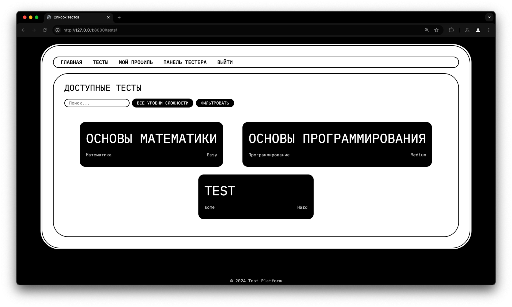
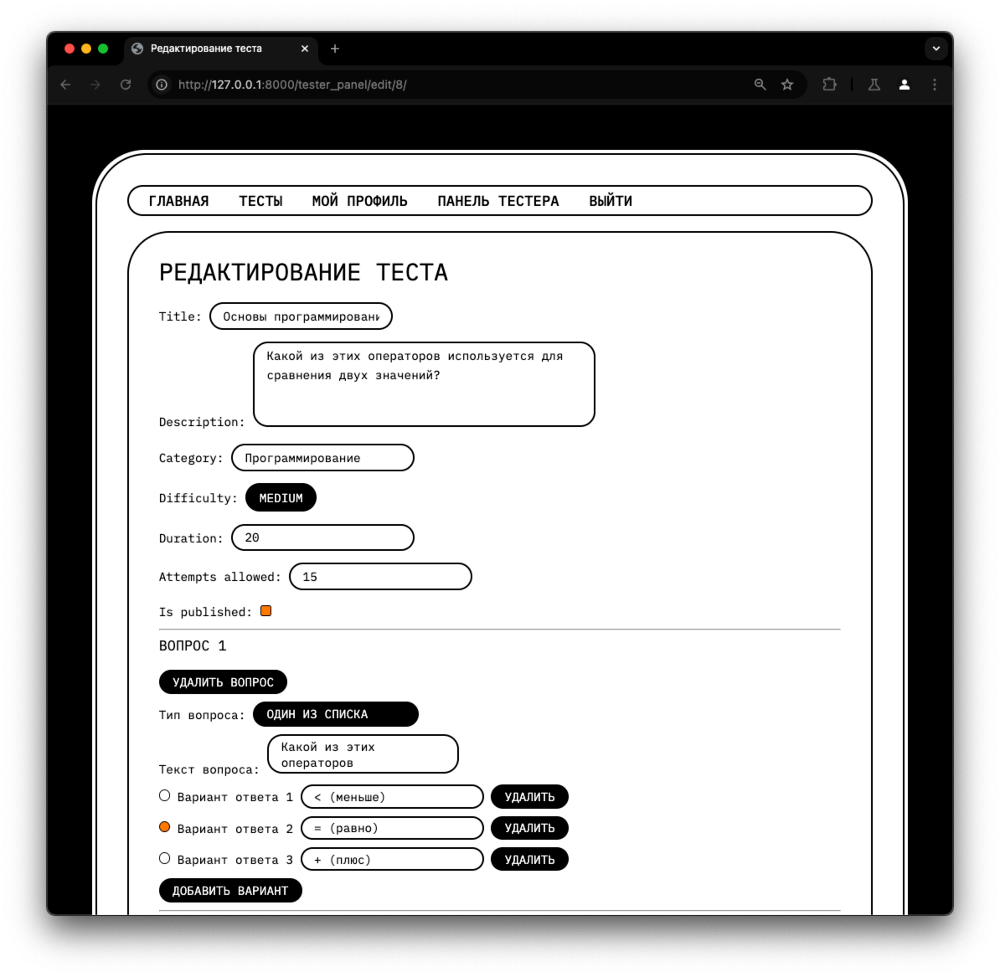

# Django Remote Testing System
<b>RTS</b> – платформа для создания и прохождения тестов. Она предоставляет интерфейс для:
<ul>
  <li>Поиска тестов</li>
  

  
  

  <li>
    Прохождения тестов
  </li>
  <li>Создания тестов</li>
  <li>Редактирования своих тестов</li>
    

  
  

  <li>Удаления своих тестов</li>
  <li>Ведение статистики прохождения тестов пользователями</li>
</ul>
